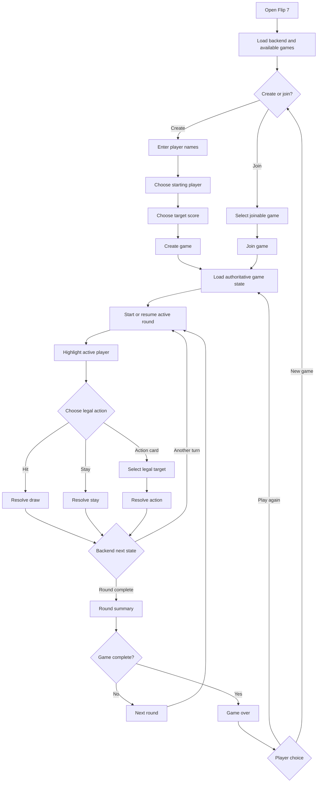

# Flip 7 Redesigned Frontend Product Requirements

## 1. Document purpose

This document is the implementation handoff for rebuilding the Flip 7 frontend using the redesigned digital-tabletop interface.

The APIs, database, and authoritative game logic already exist. The frontend should:

- present the existing game state clearly;
- expose only actions that the backend says are legal;
- guide two local players through setup, turns, round completion, and game completion;
- reproduce the visual hierarchy and atmosphere shown in the supplied redesign references;
- remain responsive, accessible, and resilient to loading, errors, stale data, and reconnects.

This document defines product behavior, user stories, interaction flows, frontend rules, visual requirements, state handling, and acceptance criteria. It does not prescribe a particular frontend framework or API endpoint structure.

---

## 2. Product summary

Flip 7 is a couch-friendly, turn-based, press-your-luck card game designed for local shared-screen play.

Players take turns deciding whether to:

- **Hit** and draw another card;
- **Stay** and bank their current round score;
- use a legal action-card effect such as **Freeze Target** or **Flip Three Target**.

The frontend must make three things obvious at all times:

1. **Whose turn it is.**
2. **What the active player may do next.**
3. **How dangerous each player’s current position is.**

The interface should feel like a premium digital tabletop rather than a dashboard or administrative application.

---

## 3. Product goals

### 3.1 Primary goals

- Make the current player and current decision unmistakable from several feet away.
- Make round score, total score, target score, deck count, and round number easy to scan.
- Make duplicate danger and press-your-luck tension visually apparent.
- Keep setup simple enough to understand without instructions.
- Ensure round-end and game-end moments feel conclusive and celebratory.
- Keep dynamic content rendered as code-driven UI rather than baked into images.
- Allow an AI coding assistant to build the UI without inferring missing user flows.

### 3.2 Secondary goals

- Support common laptop and desktop landscape sizes.
- Degrade gracefully to narrower screens.
- Support keyboard navigation and reduced-motion preferences.
- Recover safely from failed API requests or stale frontend state.
- Keep the frontend architecture independent from the exact backend implementation.

### 3.3 Non-goals

Unless already supported by the backend, this redesign does not introduce:

- new game rules;
- online matchmaking;
- chat or voice communication;
- accounts, authentication, or profiles;
- spectator controls;
- AI opponents;
- deck-building or collectible progression;
- game-history analytics;
- implementation of scoring or legality rules in the browser.

---

## 4. Core design principles

### 4.1 The board is the primary object

The active game board must dominate the screen. Utility controls, forms, connection indicators, and menus must not visually overpower gameplay.

### 4.2 One dominant focus per state

Every screen should have one obvious focus:

- setup: create or join a game;
- active round: the active player’s decision;
- action resolution: the result of the action;
- round summary: what happened and how scores changed;
- game over: who won and what to do next.

### 4.3 Shared-screen readability

The interface should remain understandable from several feet away. Critical information must use large type, strong contrast, spacious grouping, and explicit labels.

### 4.4 Backend authority

The frontend must never independently invent or recalculate:

- legal actions;
- active player;
- turn order;
- card outcomes;
- busts;
- round scores;
- total scores;
- target completion;
- winner;
- deck count;
- action-card effects;
- risk probabilities.

The backend response is the source of truth. The frontend may derive presentation-only labels from backend state, but it must not override game logic.

### 4.5 Dynamic data stays dynamic

Player names, card values, scores, statuses, warnings, round numbers, and labels must be rendered with components and text. They must not be embedded into image assets.

---

## 5. Roles and user context

### 5.1 Local player

A person playing on the shared device. Two local players alternate turns on the same screen.

### 5.2 Game host

The person who creates a game and chooses initial settings. In local play, the host may also be one of the players.

### 5.3 Joining player

A person who selects an existing game from the lobby and joins it when the backend allows joining.

### 5.4 System

The frontend and backend working together to:

- validate actions;
- resolve card draws and action effects;
- update scores;
- advance turns and rounds;
- determine when the game ends.

---

## 6. Gameplay rules represented by the frontend

These are the product rules that the UI must communicate. The backend remains authoritative if its exact behavior differs.

### 6.1 Number cards

- Number cards contribute to the current round score.
- A player’s collected number cards must remain visible during the round.
- Unique-number progress must be communicated when supplied by the backend.
- Drawing a duplicate number causes a bust unless another backend-resolved rule prevents it.

### 6.2 Bust

When the backend reports a bust:

- the affected player’s panel enters a danger/bust treatment;
- the action controls become unavailable while the result resolves;
- a clear bust result banner appears;
- the UI must not add the player’s current round score to the total unless the backend reports that it was added;
- the UI follows the next state returned by the backend, such as another player’s turn or round summary.

### 6.3 Stay

When a player stays:

- the request is sent once;
- action controls lock while resolving;
- the UI shows that the player banked or completed their round, based on backend wording/state;
- the player becomes inactive for the rest of that round if the backend reports that status;
- the backend determines the next active player or round completion.

### 6.4 Flip 7

When the backend reports seven unique numbers or a Flip 7 outcome:

- show a strong celebratory result treatment;
- clearly identify the player who achieved it;
- display the backend-provided round score or bonus;
- stop accepting gameplay actions until the backend provides the next round or game state;
- display the round summary when appropriate.

### 6.5 Freeze

When **Freeze Target** is legal:

- the control appears in the active action panel;
- selecting it enters a target-selection state unless the backend has already supplied a single legal target;
- only legal targets are selectable;
- confirming the target sends one action request;
- all controls lock while the request resolves;
- the result banner identifies the affected player and effect;
- the affected player’s status visibly reflects the backend state.

### 6.6 Flip Three

When **Flip Three Target** is legal:

- the control appears in the active action panel;
- selecting it enters a target-selection state unless there is only one legal target;
- only legal targets are selectable;
- confirming sends one request;
- the UI presents the backend-resolved sequence of draws without predicting results;
- intermediate card reveals may animate in sequence;
- the final state must match the authoritative backend response.

### 6.7 Second Chance

Second Chance should normally appear as a player card/status rather than a primary manual action, unless the backend explicitly exposes it as a legal user action.

When the backend reports that Second Chance prevented a bust:

- show a clear Second Chance result banner;
- visually indicate that the card/effect was consumed if the backend reports consumption;
- update the player’s card row and status from the returned state;
- do not briefly show an incorrect final bust state before applying the returned result.

### 6.8 Round and total scores

- **Round score** represents the player’s current or completed score for the present round.
- **Total score** represents accumulated score across completed rounds.
- The frontend displays backend-provided values without recalculation.
- Score-change callouts may animate the difference between previous and new backend states, but the final displayed value must come from the response.

### 6.9 Game completion

The game ends when the backend reports a winner, normally after a player reaches the target score.

The UI must not infer game completion solely from a displayed total. It must wait for the backend game status or winner field.

---

## 7. Frontend state model

The frontend should be able to represent at least the following top-level states.

### 7.1 Application states

- `initializing`
- `setup`
- `joining_game`
- `creating_game`
- `loading_game`
- `active_round`
- `resolving_action`
- `target_selection`
- `round_summary`
- `game_over`
- `reconnecting`
- `recoverable_error`
- `fatal_error`

The exact code names may differ, but the behavioral distinctions must remain.

### 7.2 Required game-state data

Map existing API responses into a frontend view model containing the equivalent of:

```text
game
- id
- status
- roundNumber
- deckCount
- targetScore
- activePlayerId
- actionMessage
- availableActions
- legalTargetsByAction
- winnerPlayerId
- standings

players[]
- id
- name
- seat/order
- turnStatus
- roundStatus
- roundScore
- totalScore
- riskLevel or risk data
- cards[]
- uniqueNumberCount
- statusEffects[]
- resultMessage

ui
- pendingAction
- selectedAction
- selectedTargetId
- activeOverlay
- requestError
- connectionStatus
```

The frontend may adapt different backend field names into this shape.

### 7.3 Legal action representation

The backend should be treated as supplying a set of currently legal actions, directly or indirectly.

The UI should derive button availability from that set:

- render primary gameplay actions when legal;
- disable or omit unavailable special actions;
- never allow a non-active player to trigger a gameplay action;
- never leave a previously legal action enabled after a new state response removes it.

---

## 8. Primary user flow



---

## 9. Screen requirements

## 9.1 Setup and lobby screen

### Purpose

Allow users to create a new two-player game or join an existing game without presenting a generic administrative form.

### Required content

- Flip 7 title or logo.
- Backend or service connection indicator.
- Create-game area.
- Player 1 name field.
- Player 2 name field.
- Starting-player selector.
- Target-score input or stepper.
- Target-score presets when supported.
- Create Game control.
- Join Existing Game area.
- Existing-games list.
- Game status, round, player capacity, target score, and Join control for each visible game where available.
- Loading, empty, unavailable, full, private, and error states as supported by the API.
- How to Play or rules access.

### Behavioral requirements

- Setup fields must be easy to operate with keyboard, mouse, or touch.
- The Create Game button is disabled when required fields are invalid or a create request is pending.
- Submitting the form sends one create request.
- Double-clicking or repeatedly activating Create Game must not create duplicate games.
- The starting-player selector must visibly indicate the selected player.
- Target-score controls must respect backend-supported minimums, maximums, and increments.
- Existing games should refresh using the existing backend mechanism.
- A Join button must be disabled or absent when a game is not joinable.
- Joining must lock the selected row/control until the request finishes.
- Successful create or join transitions to the authoritative game state.
- Failed create or join keeps the user’s entered data and provides a retry path.

### Empty state

When no games are joinable:

- show a friendly empty-state message;
- keep Create Game visually prominent;
- do not show a broken or blank table.

---

## 9.2 Active round screen

### Purpose

Present the complete game state and make the active player’s next decision obvious.

### Required layout

#### Header

- game title or compact logo;
- game status pill;
- round number;
- deck count;
- target score;
- menu or rules access.

#### Turn banner

- active player name;
- short instruction or backend-provided action message;
- visually associated with the active player color/treatment.

#### Player panels

Two player panels displayed side by side on normal landscape screens.

Each panel must show:

- player name;
- active, waiting, stayed, frozen, busted, or completed state;
- current round score;
- total score;
- risk label;
- card collection;
- unique-number progress when available;
- duplicate danger message when applicable;
- status effects or action-card state when relevant.

#### Action panel

- Hit;
- Stay;
- Freeze Target when legal;
- Flip Three Target when legal;
- concise explanatory labels;
- pending/loading state;
- disabled state when no action can currently be submitted.

#### Result banner

A short banner for the latest meaningful event, such as:

- card drawn;
- player stayed;
- Freeze triggered;
- Flip Three resolving;
- Second Chance used;
- duplicate danger;
- bust;
- Flip 7 achieved.

### Current-turn requirements

The active player must be unmistakable through multiple cues:

- brighter panel header;
- blue/cyan outline or glow;
- Active Player ribbon or explicit label;
- turn banner naming the player;
- enabled controls associated with that turn.

Do not rely on color alone.

### Inactive-player requirements

- Keep scores and cards fully readable.
- Reduce visual emphasis without making the panel look disabled or unavailable.
- Clearly show waiting or completed status.
- Do not render active action controls within the inactive panel.

---

## 9.3 Target-selection state

### Purpose

Allow the active player to choose the legal target for Freeze or Flip Three without ambiguity.

### Requirements

- Enter target selection only after a legal targeting action is chosen.
- Display the selected action prominently.
- Highlight every legal target.
- Visually mute or mark illegal targets as unavailable.
- Allow the player to cancel before submission.
- When only one legal target exists, the UI may either select it automatically and ask for confirmation or submit directly, depending on the desired interaction speed.
- Confirming must submit exactly one request.
- Lock all target controls while resolving.
- If the backend rejects the target, return to the current authoritative state and explain the failure.

For a two-player game, the likely target is the opponent, but the frontend must still respect backend-provided legal target IDs.

---

## 9.4 Resolving-action state

### Purpose

Prevent duplicate actions and make it clear that the selected action is being processed.

### Requirements

- Immediately lock gameplay controls after a valid submission.
- Preserve the currently visible board until an authoritative response arrives.
- Show a lightweight pending state on the chosen action.
- Do not optimistically add cards, scores, or status effects unless the API contract explicitly supports safe optimistic updates.
- Replace the board state atomically when the authoritative response arrives.
- Animate differences only after or while applying the valid response.
- On failure, unlock actions after synchronizing or restoring the last authoritative state.

---

## 9.5 Round summary overlay

### Purpose

Explain how the round ended and create a clear pause before the next round.

### Required content

- Round-complete heading.
- One result card per player.
- Player name.
- Round outcome, such as stayed, bust, frozen, or Flip 7.
- Round points earned as supplied by the backend.
- Updated total score.
- Winner-of-round treatment if applicable.
- Primary Next Round action when the game continues.

### Behavioral requirements

- The board remains visible but dimmed.
- The background is noninteractive while the dialog is open.
- Focus moves into the dialog.
- The main action is obvious.
- Next Round submits one request or navigation action according to the existing API flow.
- While advancing, the button shows loading and cannot be triggered twice.
- The dialog remains until a new authoritative round state is loaded.
- If the backend reports game completion instead, transition to Game Over rather than rendering an unnecessary next round.

---

## 9.6 Game over overlay

### Purpose

Clearly announce the winner, display final standings, and provide replay choices.

### Required content

- Game Over heading.
- Winner name.
- Strong winner treatment.
- Final standings.
- Final total scores.
- New Game control.
- Play Again with Same Settings control when supported.
- Optional rules or return-to-lobby action.

### Behavioral requirements

- The winner must be identified from backend data.
- Celebration art and confetti must not reduce text readability.
- Play Again must preserve only the settings the backend supports preserving.
- New Game returns to a clean setup state.
- Replay and new-game controls must have loading, failure, and duplicate-submission protection.

---

## 9.7 Rules/help overlay

### Purpose

Provide lightweight guidance without leaving the game.

### Minimum content

- Hit draws another card.
- Stay banks or completes the player’s round according to game rules.
- Duplicate numbers can cause a bust.
- Seven unique numbers trigger Flip 7.
- Brief descriptions of Freeze, Flip Three, and Second Chance.

### Requirements

- Open from setup and active game screens.
- Close with button, Escape, or supported dialog behavior.
- Trap and restore keyboard focus.
- Do not reset or alter game state.

---

## 10. User stories and acceptance criteria

## Epic A: Start or join a game

### US-A1: Create a new game

**As a host, I want to enter two player names and create a game so that we can begin playing locally.**

Acceptance criteria:

- Both player-name inputs are visible and clearly labeled.
- Invalid required values prevent submission.
- The selected starting player is visible.
- The selected target score is visible.
- Create Game sends one request.
- The button enters a loading state during submission.
- A successful response opens the returned game state.
- A failed response keeps entered values and shows a retryable error.

### US-A2: Choose the starting player

**As a host, I want to choose who starts so that the first turn is intentional.**

Acceptance criteria:

- Both players are shown as selectable options.
- Exactly one option is selected when required.
- Selection is communicated through more than color alone.
- The chosen identifier is included in the create request when supported.

### US-A3: Choose a target score

**As a host, I want to set the target score so that we can choose the desired game length.**

Acceptance criteria:

- Current value is visible.
- Presets or stepper controls respect backend constraints.
- Invalid values are explained.
- The create request includes the selected value.

### US-A4: Browse existing games

**As a player, I want to see existing games so that I can join one instead of creating a duplicate.**

Acceptance criteria:

- Loading state appears while games load.
- Each row shows available backend-provided identifying information.
- Joinability is obvious.
- Full, unavailable, private, or in-progress status is shown when supplied.
- Empty results show a designed empty state.

### US-A5: Join an existing game

**As a player, I want to join a joinable game so that I can continue into its current state.**

Acceptance criteria:

- Only legal Join controls are enabled.
- Activating Join sends one request.
- The selected control locks while pending.
- Success loads the authoritative game state.
- Failure keeps the lobby usable and explains what happened.

---

## Epic B: Understand the game board

### US-B1: Identify the current player

**As a player, I want to know whose turn it is immediately so that the correct person makes the decision.**

Acceptance criteria:

- The active player is named in the turn banner.
- The active panel has a distinct outline/glow and explicit label.
- Inactive players are marked waiting or with their actual backend state.
- Screen-reader users receive an appropriate turn-change announcement.

### US-B2: Understand score pressure

**As a player, I want to see round score, total score, and target score so that I understand the value of continuing or staying.**

Acceptance criteria:

- Round and total scores are visible on both panels.
- Target score remains visible during active play.
- Score labels are not dependent on position alone.
- Updated values reflect backend responses.

### US-B3: Understand card state

**As a player, I want to see both players’ cards so that I can understand progress and duplicate danger.**

Acceptance criteria:

- Cards remain readable at normal laptop widths.
- Number, modifier, and action families are visually distinct.
- Duplicate-number danger is explicitly labeled.
- Newly drawn cards may animate but settle into the authoritative order/state.

### US-B4: Understand risk

**As a player, I want a quick risk indicator so that the press-your-luck decision feels understandable.**

Acceptance criteria:

- Risk is labeled Low, Medium, High, or an equivalent backend-supported state.
- Color and text are both used.
- Duplicate danger overrides vague risk messaging with a specific warning.
- The UI does not invent probabilities not returned by the backend.

### US-B5: Understand latest action result

**As a player, I want immediate feedback after an action so that I know what changed.**

Acceptance criteria:

- A concise result banner appears for meaningful outcomes.
- The banner does not obscure required controls or scores.
- Temporary messages remain long enough to read.
- Persistent critical states, such as bust or frozen, remain visible in the player panel.

---

## Epic C: Take a turn

### US-C1: Hit

**As the active player, I want to draw another card so that I can increase my round score.**

Acceptance criteria:

- Hit is shown only or enabled only when legal.
- Activating Hit submits once.
- Controls lock while resolving.
- The UI does not predict the card.
- The returned card, score, risk, status, and next turn are rendered from the response.
- Rejected actions resynchronize the board and provide a useful error.

### US-C2: Stay

**As the active player, I want to stay so that I can stop taking risk and preserve the result allowed by the game rules.**

Acceptance criteria:

- Stay is shown only or enabled only when legal.
- Activating Stay submits once.
- The player’s resulting state comes from the response.
- The next active player or round summary is shown correctly.

### US-C3: Choose Freeze Target

**As the active player with a legal Freeze action, I want to select a target so that I can apply the effect to the intended player.**

Acceptance criteria:

- Freeze Target appears only when legal.
- Legal target IDs come from the backend.
- Target selection is clear and cancellable before submission.
- The selected target is included in one request.
- The returned frozen/skipped state is displayed clearly.

### US-C4: Choose Flip Three Target

**As the active player with a legal Flip Three action, I want to select a target so that the backend can resolve three draws for that player.**

Acceptance criteria:

- Flip Three Target appears only when legal.
- Only legal targets can be confirmed.
- The action locks while resolving.
- Card reveals may be sequenced visually but must use backend-returned results.
- Bust, Second Chance, scoring, or turn transitions reflect the final response.

### US-C5: Avoid duplicate submissions

**As a player, I want the interface to prevent accidental repeated actions so that one click produces one turn action.**

Acceptance criteria:

- All gameplay controls lock after submission.
- Pressing Enter, Space, or clicking repeatedly does not produce duplicate requests.
- A pending indicator identifies the action being resolved.
- Controls unlock only after success, error recovery, or state resynchronization.

---

## Epic D: Resolve special outcomes

### US-D1: See duplicate danger

**As a player, I want duplicate danger called out clearly so that I understand why continuing is risky.**

Acceptance criteria:

- Duplicate danger uses explicit warning text and iconography.
- The relevant card or panel receives a danger treatment.
- The warning does not falsely state that a bust has already occurred.

### US-D2: See a bust

**As a player, I want the bust result to be unmistakable so that I understand the turn or round outcome.**

Acceptance criteria:

- Bust uses a strong red result treatment.
- The affected player is named.
- The player’s round result and score use backend values.
- The UI advances only according to the next backend state.

### US-D3: See Second Chance resolve

**As a player, I want to see when Second Chance prevents a bust so that the special card’s value is understood.**

Acceptance criteria:

- The UI shows Second Chance before or with the corrected result.
- It does not flash an incorrect permanent bust state.
- Card/status consumption reflects backend data.

### US-D4: Celebrate Flip 7

**As a player, I want a strong celebration when seven unique numbers are achieved so that the game’s signature moment feels important.**

Acceptance criteria:

- The achieving player is named.
- The Flip 7 result is visually stronger than a normal draw.
- Score or bonus values come from the backend.
- Essential information remains readable with effects enabled or disabled.

---

## Epic E: Complete rounds and games

### US-E1: Review round results

**As a player, I want to see both players’ round outcomes and updated totals so that I understand the state before continuing.**

Acceptance criteria:

- Both players appear in the summary.
- Outcomes, round points, and totals are visible.
- Values match the authoritative response.
- The board is dimmed and noninteractive.

### US-E2: Begin the next round

**As a player, I want to start the next round so that play continues without returning to setup.**

Acceptance criteria:

- Next Round is the primary summary action when the game continues.
- It submits once.
- The summary remains until the new round loads.
- The new board shows reset round-specific state and preserved total scores as returned by the backend.

### US-E3: See the winner

**As a player, I want the winner and final standings clearly announced so that the game ends conclusively.**

Acceptance criteria:

- Winner identity comes from backend state.
- Final standings and totals are visible.
- Game Over is visually distinct from Round Summary.
- Celebration does not obscure text or controls.

### US-E4: Play again with the same settings

**As a player, I want a rematch using the same settings so that we can restart quickly.**

Acceptance criteria:

- The action appears only when supported.
- It sends one request.
- The frontend does not assume which fields are preserved beyond the API response.
- Success loads the new authoritative game state.

### US-E5: Start a new game

**As a player, I want to return to setup so that we can change names, starting player, or target score.**

Acceptance criteria:

- New Game clears transient frontend state.
- Setup fields return to defaults or intentionally preserved values.
- No prior game actions remain enabled.
- Existing-game data can reload normally.

---

## Epic F: Recover from system problems

### US-F1: See loading states

**As a player, I want clear loading feedback so that I know the game is responding.**

Acceptance criteria:

- Initial load, create, join, action, next round, and replay have distinct pending states.
- The screen does not appear frozen.
- Loading indicators do not cause layout jumps that hide critical context.

### US-F2: Recover from a failed action

**As a player, I want to recover from a network or API error without losing the known game state.**

Acceptance criteria:

- The last authoritative board remains visible when safe.
- A concise error explains that the action did not complete.
- The frontend refreshes or resynchronizes game state before re-enabling actions when needed.
- Retry does not replay an action whose completion status is unknown unless the API supports idempotency.

### US-F3: Recover after refresh or reconnect

**As a player, I want the game to restore after a page refresh or brief disconnect so that local play can continue.**

Acceptance criteria:

- A known game ID can be reloaded using the existing persistence approach.
- The frontend fetches the latest authoritative state.
- Reconnection messaging is visible but not disruptive.
- The active player, legal actions, overlays, scores, and cards restore correctly.

### US-F4: Handle stale state

**As a player, I want the interface to correct itself when my displayed state is outdated so that I cannot take an illegal action.**

Acceptance criteria:

- Conflict or stale-state responses trigger a game-state refresh.
- Old controls remain locked during refresh.
- The newest state replaces the stale state.
- The user receives a short explanation when useful.

---

## 11. Detailed interaction rules

### 11.1 Button priority

During a normal active turn:

1. Hit and Stay are the primary decision pair.
2. Legal special actions appear alongside or immediately after them.
3. Rules and menu actions are visually secondary.
4. Destructive navigation away from an active game must not resemble a gameplay action.

### 11.2 Button states

Every interactive control must support:

- default;
- hover where applicable;
- visible keyboard focus;
- pressed;
- loading;
- disabled;
- error recovery when relevant.

Disabled controls should not rely on low opacity alone when the reason matters. Provide explanatory text or accessible descriptions where practical.

### 11.3 Card behavior

Cards must use reusable variants rather than image screenshots.

Required families:

- number;
- positive modifier;
- multiplier;
- negative modifier;
- Freeze;
- Flip Three;
- Second Chance;
- card back when needed.

Suggested card states:

- default;
- newly drawn;
- duplicate danger;
- selected target-related card if applicable;
- disabled;
- consumed or resolved when represented by the backend.

### 11.4 Risk behavior

- Use Low, Medium, and High as presentation categories only when the API provides a category or sufficient approved data.
- Do not calculate odds unless the backend explicitly provides the necessary authoritative values and the product requires it.
- Duplicate danger is a separate explicit state, not merely another color on the meter.

### 11.5 Banner behavior

Banner hierarchy:

- information/turn: blue;
- successful stay or bank: green;
- special action: purple or blue;
- warning: orange/red;
- bust/error: red;
- Flip 7: gold/celebratory.

Noncritical banners may auto-dismiss. Critical outcomes must remain represented elsewhere after dismissal.

### 11.6 Overlay behavior

- Only one primary modal overlay may be active at a time.
- Round Summary and Game Over cannot both be shown.
- Dialog background content is noninteractive.
- Escape may close help/settings, but should not dismiss mandatory round or game results unless product rules intentionally allow it.

---

## 12. Visual requirements

### 12.1 Overall direction

The interface must feel:

- warm;
- tactile;
- premium;
- dramatic but controlled;
- playful without feeling childish;
- optimized for a shared landscape screen.

Avoid:

- generic white form pages;
- dashboard grids as the dominant visual language;
- tiny analytics-style labels;
- flat gray prototypes;
- excessive gradients, glows, or ornament that reduce readability.

### 12.2 Color roles

Use the supplied design tokens as a starting point:

- deep navy/teal board surfaces;
- cream player-panel interiors;
- gold trim and celebration accents;
- blue active-player and Hit treatment;
- green Stay treatment;
- orange/red warning and Freeze treatment;
- purple Flip Three treatment;
- red bust and severe-danger treatment.

### 12.3 Typography

Use:

- bold condensed display typography for titles, player names, scores, and actions;
- a highly readable sans serif for labels and supporting text.

Critical shared-screen text must remain comfortably readable. Do not shrink essential content merely to preserve decorative spacing.

### 12.4 Layout

Desktop landscape:

- persistent header;
- turn/result banner beneath header;
- two equal player panels side by side;
- action panel directly below or visually connected to the board;
- overlays centered above the dimmed board.

The board should occupy the majority of the viewport.

### 12.5 Active-player treatment

Use at least three cues:

- explicit Active Player label;
- bright blue/cyan outline or glow;
- stronger header/background contrast;
- turn banner association;
- inactive player status label.

### 12.6 Tension treatment

Danger should escalate visibly but remain readable:

- low risk: calm green;
- medium risk: amber;
- high risk: red;
- duplicate danger: explicit warning strip, icon, and relevant card emphasis;
- bust: strong result state rather than a subtle meter change.

---

## 13. Responsive requirements

### 13.1 Large desktop and television-like landscape

- Use the full two-panel board.
- Keep primary actions large and centered.
- Allow comfortable spacing and decorative surfaces.
- Limit maximum content width so information does not spread excessively.

### 13.2 Laptop landscape

- Preserve two columns while cards, scores, and buttons remain legible.
- Reduce nonessential decoration before reducing type size.
- Allow card rows to compress, overlap slightly, or horizontally scroll if required.

### 13.3 Narrow tablet or small browser width

- Stack player panels.
- Place the active player first regardless of seat order, while preserving explicit player identity.
- Keep the action panel directly adjacent or sticky near the active panel.
- Maintain visible round, deck, and target information.

### 13.4 Small screens

Small screens are a secondary requirement. The interface should remain usable, but the redesign is optimized for shared landscape play.

- Stack all major regions.
- Keep minimum touch targets of 44 by 44 CSS pixels.
- Avoid horizontal page overflow.
- Allow card-row scrolling within its container when necessary.
- Ensure dialogs fit within the viewport and can scroll internally.

---

## 14. Accessibility requirements

- All interactive controls must be keyboard reachable.
- Keyboard focus must be highly visible.
- Buttons must have accessible names matching their action.
- Disabled states should expose useful explanations when possible.
- Dialogs must trap focus and restore it on close.
- Turn changes and important action results should use a restrained `aria-live` region.
- Do not announce every decorative animation or score tick.
- Risk, status, and turn must never be communicated through color alone.
- Text contrast should meet WCAG AA where practical.
- Motion must respect `prefers-reduced-motion`.
- Reduced-motion mode must preserve all information using immediate state changes or simple fades.
- Confetti and celebratory effects should be decorative and hidden from assistive technology.

---

## 15. Motion and feedback requirements

Suggested timing:

- button response: immediate visual press;
- card draw: 220–320 ms;
- active-player glow transfer: 180–250 ms;
- result banner entrance: about 200 ms;
- modal entrance: 180–240 ms;
- score-change callout: short enough not to delay the next state.

Rules:

- Animation must not delay authoritative state indefinitely.
- Inputs remain locked for the true request duration, not merely the animation duration.
- Long Flip Three sequences should provide a skip or reduced-motion path if they become disruptive.
- The final board must always settle into the exact backend state.

---

## 16. API integration requirements

The coding assistant must inspect and map the existing API rather than inventing endpoints.

### 16.1 Required frontend operations

Map existing APIs for the equivalent of:

- list existing games;
- create game;
- join game;
- load game state;
- submit Hit;
- submit Stay;
- submit Freeze with target;
- submit Flip Three with target;
- advance to next round when required;
- replay with same settings when supported;
- start or return to a new game;
- reconnect or refresh game state.

### 16.2 Response handling

For every mutation:

1. Confirm the action is legal in the current frontend state.
2. Lock relevant controls.
3. Submit one request.
4. Receive authoritative state or error.
5. Replace or reconcile the local view model.
6. Transition to the screen or overlay implied by the response.
7. Unlock controls only after the state is stable.

### 16.3 Idempotency and duplicate protection

- Use API-provided idempotency, action IDs, versions, or expected-state tokens when available.
- Do not blindly retry uncertain gameplay mutations.
- Safe reads may retry using normal network policies.
- If a mutation times out and its completion is unknown, reload game state before allowing another action.

### 16.4 State versioning

When the backend exposes a version, revision, turn number, or updated timestamp:

- store it with the current state;
- include it in mutations if required;
- reject or refresh stale UI when a conflict occurs.

---

## 17. Error, loading, and empty states

### 17.1 Initial backend unavailable

Show:

- game branding;
- clear connection problem;
- Retry control;
- no misleading setup submission controls until availability is known, unless offline setup is intentionally supported.

### 17.2 Existing-game list failure

- Keep Create Game available if its API is usable.
- Show an inline retry state in the list area.
- Do not replace the entire screen with an error unless the whole service is unusable.

### 17.3 Mutation failure

- Keep the last confirmed board visible.
- State that the action was not confirmed.
- Resynchronize before accepting another gameplay mutation when outcome is uncertain.

### 17.4 Game no longer available

- Explain that the game ended, expired, was removed, or cannot be joined based on backend information.
- Offer a return to setup or lobby.

### 17.5 No legal actions

If the backend returns no legal action during an apparently active turn:

- do not invent buttons;
- show a waiting/resolving state;
- refresh according to the existing synchronization mechanism;
- provide diagnostic logging for developers.

---

## 18. Analytics and diagnostics

Only implement analytics if the product already uses them or explicitly requests them.

Useful non-sensitive events may include:

- setup viewed;
- create attempted/succeeded/failed;
- join attempted/succeeded/failed;
- action selected;
- action request failed;
- round summary viewed;
- game over viewed;
- replay selected;
- reconnect occurred.

Do not send player names, card data, or private game identifiers to third-party analytics unless approved.

Development logging should make it possible to diagnose:

- current game ID;
- state version;
- pending action type;
- API failure category;
- transition from previous to next frontend state.

Avoid logging secrets or unnecessary personal data.

---

## 19. Component inventory

The implementation should include reusable equivalents of:

```text
Flip7App
├── AppShell
├── AppHeader
│   ├── GameLogo
│   ├── ConnectionStatus
│   ├── GameStatusPill
│   ├── RoundBadge
│   ├── DeckBadge
│   ├── TargetScoreBadge
│   └── MenuButton
├── SetupScreen
│   ├── PlayerCreationForm
│   ├── StartingPlayerSelector
│   ├── TargetScoreControl
│   ├── CreateGameButton
│   ├── ExistingGamesList
│   ├── ExistingGameRow
│   └── LobbyEmptyState
├── GameBoard
│   ├── TurnBanner
│   ├── ResultBanner
│   ├── PlayerPanel × 2
│   │   ├── PlayerHeader
│   │   ├── ScoreLine
│   │   ├── RiskMeter
│   │   ├── CardRow
│   │   ├── GameCard
│   │   └── PlayerStatusMessage
│   ├── ActionPanel
│   │   ├── HitButton
│   │   ├── StayButton
│   │   ├── FreezeTargetButton
│   │   └── FlipThreeTargetButton
│   └── TargetSelectionLayer
├── RoundSummaryDialog
├── GameOverDialog
├── RulesDialog
├── ErrorNotice
└── LoadingState
```

Components should accept data and emit intent. API calls and game-state transitions should be coordinated outside purely presentational components.

---

## 20. Asset rules

### Use provided individual assets for

- full logo;
- compact logo;
- Flip 7 burst;
- confetti;
- crown;
- tabletop texture;
- paper texture;
- player, deck, target, round, menu, warning, Freeze, Flip Three, Second Chance, bust, and help icons where suitable.

### Build in code

- cards and card values;
- buttons and button states;
- player panels;
- status pills;
- score badges;
- risk meters;
- inputs and selectors;
- lobby rows;
- modal frames;
- banners;
- all dynamic labels and values.

### Prohibited asset usage

- Do not use the full mockup as a background.
- Do not crop interface pieces from the asset-sheet screenshots.
- Do not bake player names, scores, round numbers, or button labels into images.
- Do not stretch logos or icons out of proportion.

---

## 21. Definition of done

The redesigned frontend is complete when:

### Product behavior

- Setup supports player names, starting player, target score, create, and join.
- Existing games have loading, joinable, unavailable, and empty states.
- The active player is unmistakable.
- Both players show cards, round score, total score, risk, and status.
- Hit and Stay follow backend legality.
- Freeze and Flip Three support legal target selection.
- Second Chance, duplicate danger, bust, and Flip 7 outcomes are represented.
- Round Summary displays both results and updated totals.
- Game Over displays winner, standings, New Game, and supported replay actions.
- Refresh, reconnect, stale state, and API failure paths are handled.

### Visual quality

- The game board dominates the active-play screen.
- The UI resembles the supplied redesign in hierarchy and atmosphere.
- The interface does not look like a generic dashboard.
- Dynamic UI is not baked into image files.
- The active turn and next action are readable from a distance.

### Responsive quality

- Common desktop and laptop landscape sizes show two readable player panels.
- Narrow screens stack panels with the active player first.
- Actions remain visible and comfortably usable.
- Dialogs do not clip critical content or controls.

### Accessibility

- Every action is keyboard accessible.
- Focus states are visible.
- Dialog behavior is correct.
- Status and risk do not rely on color alone.
- Turn and major result announcements are accessible.
- Reduced-motion mode preserves all information.

### Integration quality

- Existing APIs are used rather than replaced.
- The backend remains authoritative.
- Duplicate submissions are prevented.
- Unknown mutation outcomes cause resynchronization before retry.
- No frontend rule guesses can create an illegal game state.

---

## 22. AI implementation instruction

Use this document as the behavioral source of truth and the supplied mockups, design-system document, component specifications, and individual assets as the visual source of truth.

Before coding:

1. Inspect the existing repository structure.
2. Identify the framework, routing, state-management, styling, and testing conventions already in use.
3. Inspect all existing game APIs and current game-state types.
4. Map API responses into a stable frontend view model.
5. Reuse existing logic and services rather than duplicating them.
6. Identify any mismatch between this UI specification and the actual backend contract.
7. Prefer the backend contract when gameplay behavior conflicts, and document the mismatch.

During implementation:

- build reusable components;
- use design tokens;
- keep gameplay mutations centralized;
- keep presentational components free of rule calculations;
- add loading, disabled, error, and accessibility states from the beginning;
- verify each user story and acceptance criterion;
- do not treat the mockup or asset sheets as pixel-perfect spritesheets.

The completed UI should feel like the redesigned premium tabletop experience while remaining a faithful client of the existing backend.
