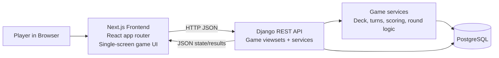
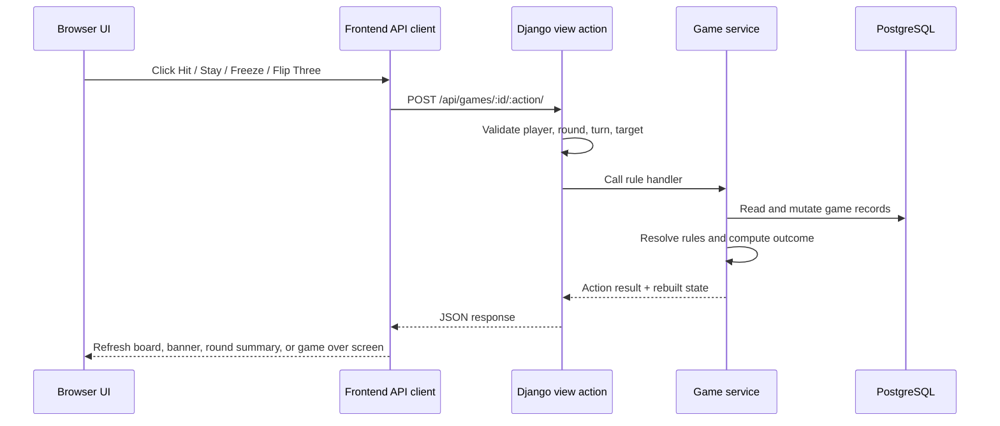

# System Architecture

Flip 7 is a single-repo web application with a thin React frontend, a Django REST backend, and a PostgreSQL database. The backend is authoritative for game rules, turn validation, deck state, scoring, and round transitions. The frontend renders backend state and submits player intents.

## High-level view

## Runtime responsibilities

### Frontend

- Owns presentation, screen routing, local pending-state handling, and reconnect UX.
- Fetches players, games, game state, and results from the backend.
- Submits legal actions such as hit, stay, freeze, and flip three.
- Does not recompute scoring, busts, or turn order.

### Backend API

- Exposes CRUD-style endpoints for core records plus custom game and round actions.
- Validates turn ownership, membership, active-player targeting, and input payloads.
- Returns user-facing error payloads with `error`, `error_code`, and optional `details`.

### Game services

- Seed and shuffle the official 94-card deck.
- Draw cards and move them between `deck`, `line`, and `discard` zones.
- Resolve duplicate busts, Second Chance, Freeze, Flip Three, and Flip 7.
- Compute per-round scores and cumulative totals.
- Build the canonical game-state payload consumed by the frontend.

### Database

- Stores game metadata, roster membership, rounds, turns, deck/card instances, and end-of-game standings.
- Persists current card locations per game so the backend can reconstruct player lines and remaining deck size.

## Request flow

The most important runtime path is a player action.

## Deployment shape today

The repository currently ships with a Docker Compose stack intended for local development:

- PostgreSQL container
- Django backend container
- Next.js frontend container

That Compose path is useful as a baseline architecture, but the checked-in runtime remains development-oriented rather than production-oriented.

## Source map

- Backend entrypoints: `backend/flip7_backend/settings.py`, `backend/flip7_backend/urls.py`
- API layer: `backend/game/views.py`, `backend/game/urls.py`, `backend/game/serializers.py`
- Rules engine: `backend/game/services.py`
- Data model: `backend/game/models.py`
- Frontend shell: `frontend/src/app/page.tsx`
- Frontend transport/types: `frontend/src/lib/api.ts`, `frontend/src/lib/types.ts`
- Frontend UI primitives: `frontend/src/components/ui.tsx`, `frontend/src/components/modals.tsx`