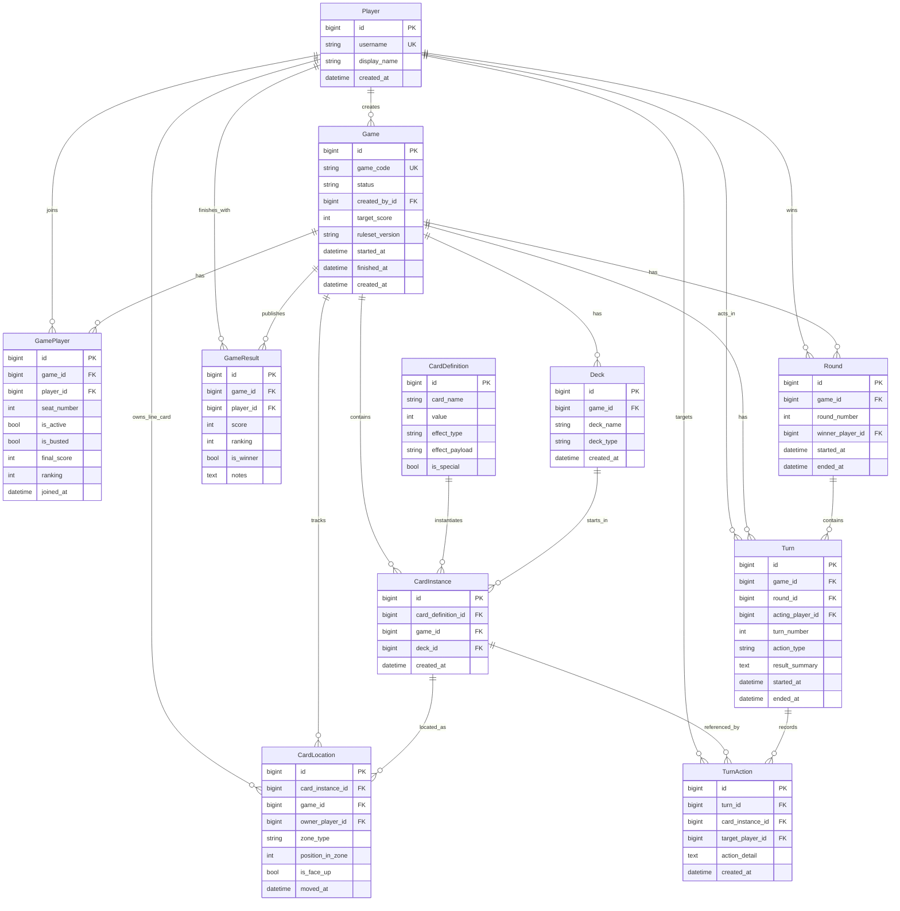

# Database Overview

The Flip 7 backend uses a normalized relational model to separate players, games, memberships, card definitions, per-game card instances, card locations, round history, turn history, and final standings.

## Entity relationship diagram

## Model groups

### Identity and lobby

- `Player` stores reusable user identities.
- `Game` stores the lifecycle of a single multiplayer session.
- `GamePlayer` is the roster join table that assigns seat order and round-level active/busted flags.

### Cards and deck state

- `CardDefinition` describes the abstract card type such as `7`, `+4`, `Freeze`, or `Second Chance`.
- `CardInstance` materializes one concrete card inside one game deck.
- `Deck` groups instances for a game.
- `CardLocation` tracks where each instance currently is:
  - `deck`
  - `line`
  - `discard`

This split is what allows the backend to model a persistent shared deck across multiple rounds while preserving the official card frequencies.

### Round and turn history

- `Round` captures the start and end of each round and optionally the Flip 7 winner.
- `Turn` captures the acting player rotation for a round.
- `TurnAction` is available to record action-level detail, although the main gameplay flow currently relies more heavily on live state and service return payloads.

### Final standings

- `GameResult` stores final ranking rows for completed games.
- `GamePlayer.final_score` acts as the running total during the game.

## Constraints that matter

- A player can join a game only once.
- A seat number can be used only once per game.
- Seat numbers must be positive.
- Card locations only allow `deck`, `line`, or `discard`.
- `line` cards must belong to a player; `deck` and `discard` cards must not.
- One final result row exists per game/player pair.

## State reconstruction

The frontend board is not persisted as a separate read model. Instead, the backend rebuilds it from the relational model by combining:

- `Game`
- the latest `Round`
- the latest `Turn`
- `GamePlayer` rows ordered by seat
- each player's current `CardLocation` rows in the `line` zone
- computed round score and unique-number count

That reconstructed payload is exposed through the game state endpoint and treated as the canonical board state by the frontend.