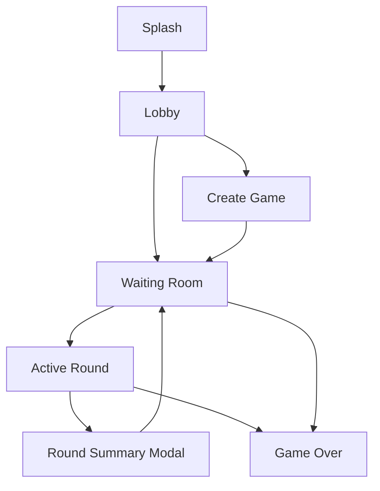
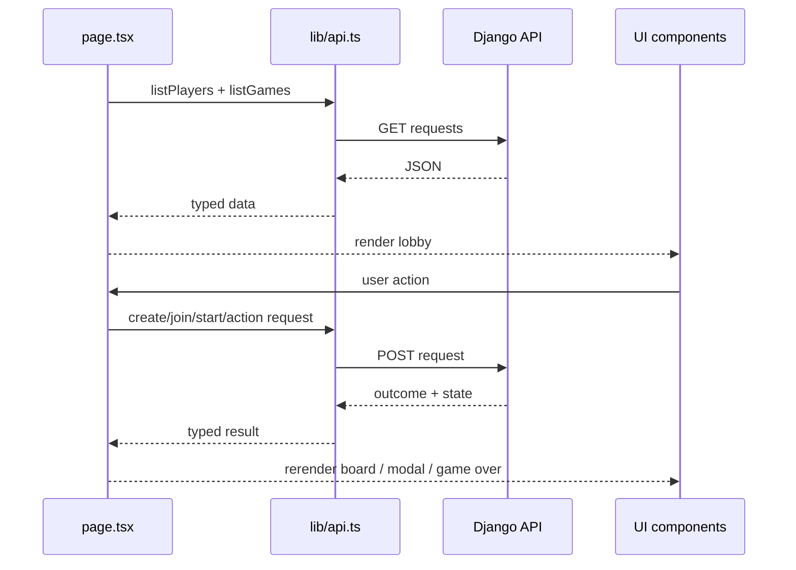

# Frontend Walkthrough

The frontend is a Next.js app-router application with one primary interactive page. It behaves like a small state machine: the current screen is derived from loading state, local workflow state, and the backend game state.

## Frontend goals

- Present the redesigned game flow clearly on desktop and mobile.
- Keep game rules on the backend.
- Centralize network access in one API client.
- Provide resilient UX for reconnects, pending actions, and round transitions.

## Screen flow

## Main modules

### App shell

- `frontend/src/app/page.tsx`
- Owns the top-level screen state:
  - `splash`
  - `lobby`
  - `create`
  - `waiting`
  - `active`
  - `game_over`
- Loads players and games for the lobby.
- Opens an existing game or creates a new one.
- Starts rounds, submits actions, and refreshes game state.
- Handles local storage recovery for the active game id.
- Shows transient UI elements such as banners, toasts, reconnect dialogs, and round summaries.

### API client

- `frontend/src/lib/api.ts`
- Wraps `fetch` for all backend calls.
- Uses `NEXT_PUBLIC_API_URL` as the backend base URL.
- Converts transport errors and non-JSON server failures into consistent exceptions.

### Shared types

- `frontend/src/lib/types.ts`
- Defines the TypeScript contract for:
  - game summaries
  - canonical game state
  - action results
  - final standings

### Presentation helpers

- `frontend/src/lib/presentation.ts`
- Maps raw backend data into presentation-only concepts such as card family, risk meter state, and user-facing action feedback.
- This layer is intentionally not the rule engine.

### UI primitives

- `frontend/src/components/ui.tsx`
- Reusable primitives such as buttons, pills, cards, risk meter, modal container, and player panels.
- Receives already-prepared props and does not own gameplay mutations.

### Modal flows

- `frontend/src/components/modals.tsx`
- Contains the rules modal, close-game confirmation, disconnect dialog, and round summary modal.

## Data flow

## Interaction model

### Lobby and game creation

- The lobby loads the current player roster and game list.
- Creating a game resolves player identities first, creating any missing players.
- The first player becomes `created_by` and auto-joins seat 1.
- Remaining named players join with incrementing seat numbers.

### Waiting room

- Waiting-room state exists before the first round or between rounds.
- Players can be removed before the game has started.
- Starting a round moves the UI into the active gameplay screen.

### Active round

- The active screen uses backend state to determine the highlighted player.
- The board shows each player's cards, current round score, cumulative total, and unique-number progress.
- Hit and stay actions submit immediately.
- Freeze and Flip Three first enter a target-selection mode, then submit with a chosen target.
- After a successful action, the page refreshes the canonical game state and updates banners or round summary data.

### Round summary and game over

- When a round ends, the frontend builds or consumes a summary payload and shows the round summary modal.
- If the backend reports `status: finished`, the page fetches final results and routes to the game-over screen.

## UX resilience

- A single-flight guard prevents duplicate concurrent actions.
- Pending state disables conflicting interactions.
- Network failures open a reconnect flow instead of silently losing the board.
- The active game id is stored in local storage to help recover from refreshes.

## Styling and redesign notes

- Global styling lives in `frontend/src/app/globals.css`.
- The UI component layer is intentionally prop-driven and presentation-focused.
- Card visuals and risk messaging are derived from backend card metadata rather than from duplicated gameplay logic.

## What the frontend deliberately does not do

- It does not compute legal turns.
- It does not score hands.
- It does not decide whether a player busted.
- It does not resolve the effects of Freeze, Flip Three, or Second Chance.

Those behaviors belong to the backend services and should remain there.